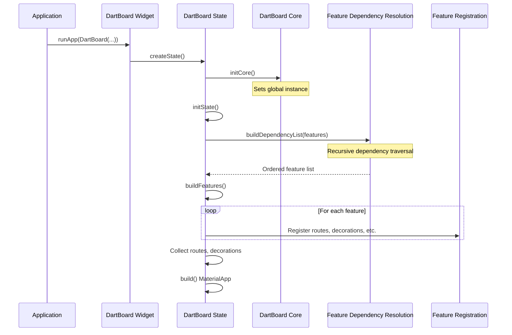

# Dart Board Core Initialization Process

This document provides an in-depth explanation of the initialization process for Dart Board Core, including order dependencies, best practices, and common pitfalls.

## Overview

Dart Board Core uses a specific initialization sequence that respects feature dependencies. Understanding this process is critical when building features that integrate with the system, especially when your features depend on each other.

## Initialization Sequence



### Key Phases

1. **Core Initialization**: The `DartBoardCore` mixin is initialized, setting a global instance.
2. **Dependency Resolution**: Features are processed in dependency order (dependencies before dependents).
3. **Feature Registration**: Routes, app decorations, and page decorations are collected.
4. **Rendering**: The application UI is built using the collected routes and decorations.

## Critical Order Dependencies

### Feature Dependencies

Features declare their dependencies via the `dependencies` getter. The system guarantees that dependencies will be initialized before the features that depend on them. This is critical for:

- **Locator Services**: Features that register types should be initialized before features that use those types.
- **Authentication**: Authentication services must be initialized before features that depend on authentication state.
- **Theme Providers**: Theme services should be initialized before UI components that rely on them.

### Decoration Processing Order

Decorations are processed in a specific order:

1. **App Decorations**: Applied globally, in reverse order (last registered is innermost).
2. **Page Decorations**: Applied to specific routes based on allow/deny lists.

## Common Pitfalls

### 1. Circular Dependencies

```
Feature A → Feature B → Feature C → Feature A
```

Circular dependencies can cause initialization problems and should be avoided. Restructure your features to break these cycles.

### 2. Premature Service Usage

Don't assume a service is available just because you've declared the dependency. Services like Locator might need to process their app decorations before they're fully functional.

**Example of incorrect usage:**
```dart
class MyFeature extends DartBoardFeature {
  // Dependency is declared correctly
  @override
  List<DartBoardFeature> get dependencies => [LocatorFeature()];
  
  // But constructor might run before Locator is fully initialized
  MyFeature() {
    final service = locate<MyService>(); // May fail!
  }
}
```

**Correct approach:**
```dart
class MyFeature extends DartBoardFeature {
  @override
  List<DartBoardFeature> get dependencies => [LocatorFeature()];
  
  @override
  List<DartBoardDecoration> get appDecorations => [
    DartBoardDecoration(
      name: 'MyFeatureInit',
      decoration: (context, child) {
        // Now safe to use the locator
        final service = locate<MyService>();
        return child;
      }
    )
  ];
}
```

### 3. State Initialization Order

When using multiple state providers (like Locator), be aware of their initialization order. If Service B depends on Service A, make sure features are ordered correctly.

### 4. Feature Override Confusion

Feature overrides allow switching implementations at runtime, but can cause confusion if not properly understood:

- Setting a feature override to `null` disables the feature entirely
- Using an implementation name that doesn't exist will cause the feature to be ignored

## Best Practices

### 1. Explicit Dependencies

Always explicitly declare all feature dependencies:

```dart
@override
List<DartBoardFeature> get dependencies => [
  LocatorFeature(),
  AuthenticationFeature(),
];
```

### 2. Lazy Service Initialization

Use lazy initialization for services when possible:

```dart
// Instead of eager initialization
final service = locate<MyService>();

// Use lazy access
void doSomething() {
  final service = locate<MyService>();
  service.performAction();
}
```

### 3. Use LifeCycleWidget for Initialization

For services that need to be initialized in sequence, use `LifeCycleWidget`:

```dart
DartBoardDecoration(
  name: 'ServiceInitialization',
  decoration: (context, child) => LifeCycleWidget(
    preInit: () {
      // Runs before children are built
    },
    init: (context) {
      // Runs during first build with context
    },
    dispose: () {
      // Cleanup
    },
    child: child,
  ),
)
```

### 4. Testing for Initialization Order

When developing features, test with various initialization orders to ensure robustness. The test suite includes a framework for testing initialization order dependencies.

## Advanced: Order-Sensitive Features

Some features, like the Locator, are particularly sensitive to initialization order. For these features:

1. Use app decorations to register services during the initialization phase
2. Ensure services are fully initialized before they're used
3. Consider using a lazy initialization pattern for service access
4. Add validation to detect when services are used before they're ready

## Debugging Initialization Issues

If you encounter initialization problems:

1. Check feature dependency declarations
2. Verify feature implementation names match what's expected
3. Look for circular dependencies
4. Use the Debug feature to inspect the initialization sequence
5. Add temporary logging to track initialization order

## Testing Your Features

The test suite includes `initialization_order_test.dart` which helps verify that features initialize correctly. Use it as a model for testing your own features.
